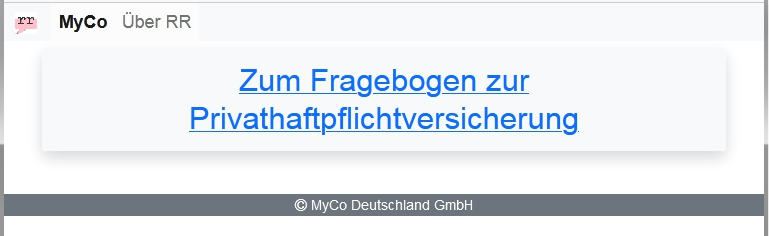
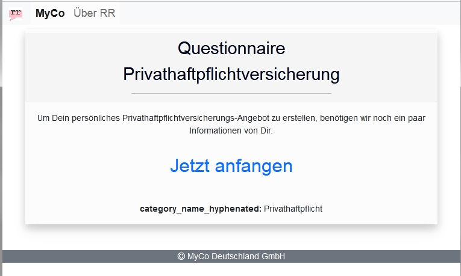
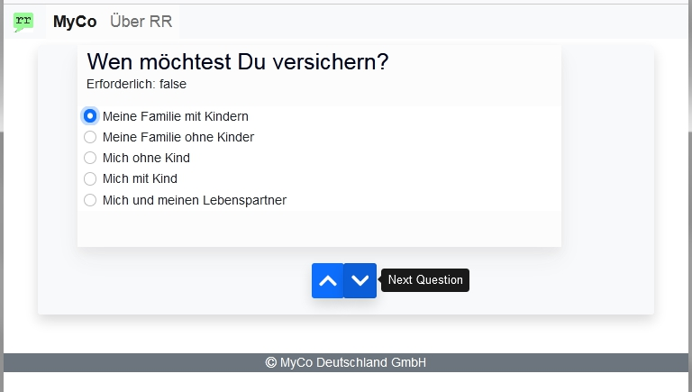
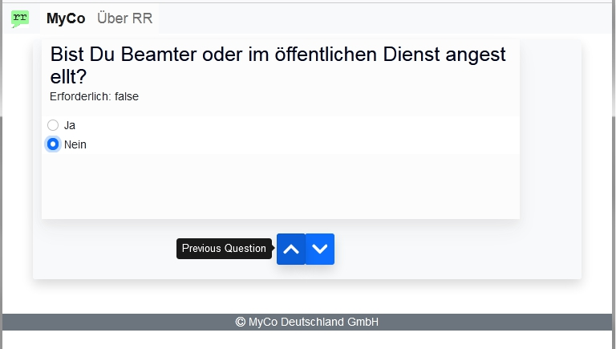
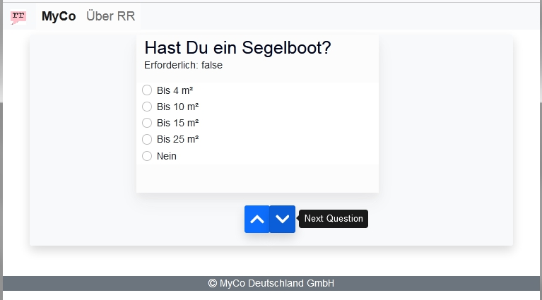
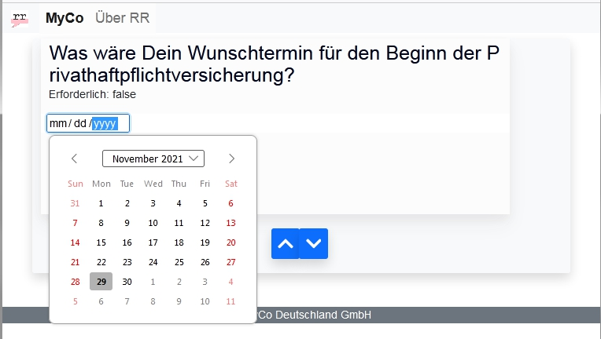
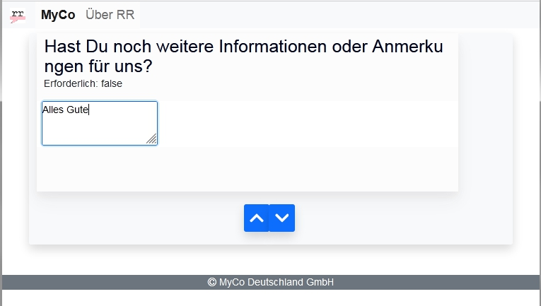
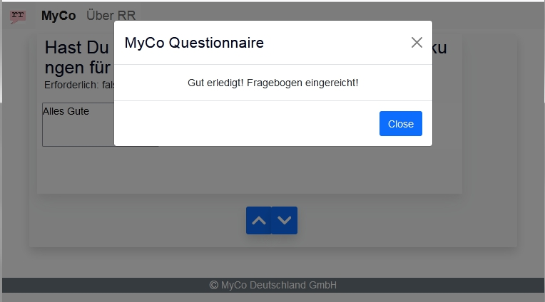

# MyCo Questionnaire

## Notes for Reviewers
Visit us at:
https://myco-qnr.netlify.app/

Alternatively, you may also deploy the site in your own local environment and test.

### Site built with:
- Ember.js
- Modern JavaScript / ECMAScript (ES6+)
- CSS
- HTML
- Bootstrap
- Fonts

### Questionnaire wizard with functionalities:
- Navbar and Header title
- Welcome page
- Footer
- Start page with the link to start the questionnaire
- Beautiful radio buttons
- Next/Previous buttons to navigate among questions. Answers will be retained as answered/unanswered while navigating.
- Question box size animation "Ember Animated"
- Calendar compontent
- Freetext multiline textarea component
- In-page popup (snackbar/toast) inspired from Material UI. Again thanks to Bootstrap developers!

### Browser Compatibility
Tested with the following browsers(up-to-date versions):
- Mozilla Firefox
- Chrome
- Epic
- Safari TODO

### Note
Minor known imperfections are left there in the app/site which may be improvised as per client requirements.
For example, text wrap without hyphenation is active.
Principle: "Do not spend time on what's not required." 

### Known Bug
The icons of Next Question and Previous Question buttons are not visible in Chrome browser.

### Screenshots

  
Welcome Page, Navbar in Header and Footer  

  
Start Page to Start the Questionnaire  

Beautiful Radio Buttons and Next Question Button  

  
Previous Question Button  

  
Unanswered Question  

  
Calendar as Date Picker  

  
Textarea Input  

  
Beautiful Popup from Bootstrap  

### Thanks for reviewing. Feedback is welcome!

##Developer Notes
This README outlines the details of collaborating on this Ember application.
A short introduction of this app could easily go here.

### Prerequisites

You will need the following things properly installed on your computer.

* [Git](https://git-scm.com/)
* [Node.js](https://nodejs.org/) (with npm)
* [Ember CLI](https://ember-cli.com/)
* [Google Chrome](https://google.com/chrome/)

### Installation

* `git clone <repository-url>` this repository
* `cd myco-questionnaire`
* `npm install`

### Running / Development

* `ember serve`
* Visit your app at [http://localhost:4200](http://localhost:4200).
* Visit your tests at [http://localhost:4200/tests](http://localhost:4200/tests).

#### Code Generators

Make use of the many generators for code, try `ember help generate` for more details

#### Running Tests

* `ember test`
* `ember test --server`

#### Linting

* `npm run lint`
* `npm run lint:fix`

#### Building

* `ember build` (development)
* `ember build --environment production` (production)

#### Deploying

Local environment with Node.js suffices. Alternatively, clouds or containers may also be used.

### Useful Links

* [ember.js](https://emberjs.com/)
* [ember-cli](https://ember-cli.com/)
* Development Browser Extensions
  * [ember inspector for chrome](https://chrome.google.com/webstore/detail/ember-inspector/bmdblncegkenkacieihfhpjfppoconhi)
  * [ember inspector for firefox](https://addons.mozilla.org/en-US/firefox/addon/ember-inspector/)
# myco-questionnaire
